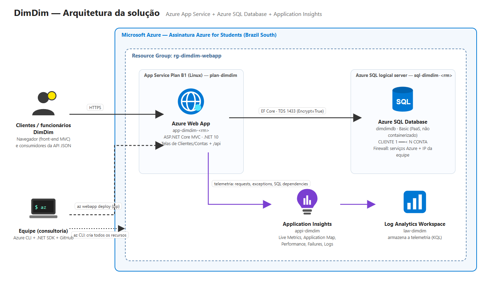

# DimDim — Web App + Azure SQL + Application Insights

2º Checkpoint (2º semestre) — DevOps Tools & Cloud Computing — Prof. João Menk

**Grupo AzureDim**

| Nome | RM |
|---|---|
| Erick Bernardes Bradaschia | 565733 |
| Gabriel Santos Claudino | 564054 |
| Kaiky de Oliveira Silva | 566067 |
| Lucas Fortes de Lima | 559523 |
| Jonathan Moreira Gomes | 565060 |

**Vídeo com as evidências:** https://youtu.be/KVN07HfIc8U

---

## 1. Descrição da solução

O **DimDim** é um banco digital que precisava tirar seu sistema de cadastro do ambiente local e levá-lo para a nuvem. Nossa consultoria entregou uma aplicação web em **ASP.NET Core MVC (.NET 10)** publicada no **Azure Web App**, gravando os dados em um banco **PaaS Azure SQL Database** (não containerizado) e monitorada pelo **Application Insights**.

A aplicação tem:

- **Front-end** (telas MVC) para cadastrar, listar, editar, detalhar e excluir **Clientes** e **Contas**;
- **API JSON** (`/api/clientes` e `/api/contas`) com GET, POST, PUT e DELETE, usada nos testes automatizados;
- **Duas tabelas relacionadas**: `CLIENTE (1) ----< (N) CONTA` — um cliente pode ter várias contas;
- **CRUD completo nas duas tabelas**;
- **Monitoramento**: requisições, exceções e cada comando SQL enviado ao banco aparecem no Application Insights (Live Metrics, Application Map, Performance, Failures, Logs);
- **Infraestrutura 100% via Azure CLI** e **deploy automatizado com `az webapp deploy`**.

Nenhuma credencial fica no código: a string de conexão é gravada como *Connection String* do Web App pelo script do CLI, e a senha do banco é digitada no terminal (ou lida da variável `SQL_ADMIN_PASSWORD`).

### Tecnologias

| Camada | Tecnologia |
|---|---|
| Aplicação | ASP.NET Core MVC .NET 10 + Entity Framework Core 10 (SQL Server) |
| Hospedagem | Azure App Service (Web App Linux, plano B1) |
| Banco de dados | Azure SQL Database (Basic, PaaS) |
| Monitoramento | Application Insights + Log Analytics Workspace |
| Automação | Azure CLI + `az webapp deploy` (bash) |

---

## 2. Arquitetura da solução



Fluxo: o usuário acessa o Web App por HTTPS → o Web App lê/grava no Azure SQL Database (porta 1433, conexão criptografada) → a telemetria da aplicação e do banco vai para o Application Insights, que armazena no Log Analytics. A equipe cria toda a infraestrutura e faz o deploy pelo Azure CLI.

---

## 3. Banco de dados

DDL completo em [`scripts/ddl.sql`](scripts/ddl.sql).

| Tabela | Colunas | Chaves |
|---|---|---|
| `CLIENTE` | ID_CLIENTE, NOME, CPF, EMAIL, TELEFONE, DT_CADASTRO | PK ID_CLIENTE, CPF único |
| `CONTA` | ID_CONTA, AGENCIA, NUMERO, TIPO, SALDO, DT_ABERTURA, ID_CLIENTE | PK ID_CONTA, FK ID_CLIENTE → CLIENTE (ON DELETE CASCADE) |

Regras: `TIPO` aceita `CORRENTE`, `POUPANCA` ou `SALARIO`; `SALDO` não pode ser negativo; agência + número é único.

Consultas para conferir a persistência após cada operação: [`scripts/consultas.sql`](scripts/consultas.sql).

---

## 4. Estrutura do repositório

```
├── api-json/            JSON das operações GET, POST, PUT e DELETE (clientes e contas)
├── docs/                desenho da arquitetura
├── scripts/
│   ├── 00-variaveis.sh        nomes dos recursos (usado por todos os scripts)
│   ├── 01-criar-recursos.sh   cria toda a infraestrutura na Azure
│   ├── 02-criar-tabelas.sh    executa o DDL no Azure SQL
│   ├── 03-deploy.sh           build + deploy com az webapp deploy
│   ├── 04-testes-api.sh       testa o CRUD das duas tabelas
│   ├── 05-remover-recursos.sh apaga tudo
│   ├── ddl.sql                DDL das tabelas
│   └── consultas.sql          SELECTs para conferir os dados
└── src/DimDim.Web/      código-fonte da aplicação
```

---

## 5. How to — implantação completa na Azure

### 5.1 Pré-requisitos

- Conta Azure (ex.: Azure for Students)
- [Azure CLI](https://learn.microsoft.com/cli/azure/install-azure-cli) (`az --version`)
- [.NET 10 SDK](https://dotnet.microsoft.com/download) (`dotnet --version`)
- [sqlcmd](https://learn.microsoft.com/sql/tools/sqlcmd/sqlcmd-utility) (`sqlcmd --version`) — opcional, dá para usar o Query Editor do portal
- `curl`, `zip` e `python3` (já vêm no macOS/Linux; no Windows use Git Bash ou WSL)

### 5.2 Clonar o repositório e entrar na Azure

```bash
git clone https://github.com/kaiky06301/dimdim-webapp.git
cd dimdim-webapp
az login
```

Se tiver mais de uma assinatura: `az account set --subscription "<nome ou id>"`.

### 5.3 Ajustar as variáveis (opcional)

Em `scripts/00-variaveis.sh` o RM entra no nome do SQL Server e do Web App, que precisam ser únicos no mundo. Para usar outro RM sem editar o arquivo:

```bash
export RM=rm123456
```

A assinatura **Azure for Students** só libera algumas regiões (mexicocentral, chilecentral, eastus, eastus2, northcentralus) e recusa a `brazilsouth`. Por isso, na implantação do vídeo usamos `LOCATION=mexicocentral` (passo 5.4).

### 5.4 Criar os recursos na Azure

```bash
chmod +x scripts/*.sh
LOCATION=mexicocentral ./scripts/01-criar-recursos.sh
```

O script pede a senha do administrador do banco (mínimo 8 caracteres com maiúscula, minúscula, número e símbolo) e cria:

1. Resource Group `rg-dimdim-webapp`
2. Azure SQL Server `sql-dimdim-<rm>` + banco `dimdimdb` (Basic)
3. Regras de firewall: serviços da Azure + IP da sua máquina
4. Log Analytics `law-dimdim` + Application Insights `appi-dimdim`
5. App Service Plan `plan-dimdim` (Linux B1) + Web App `app-dimdim-<rm>` (.NET 10)
6. App Setting `APPLICATIONINSIGHTS_CONNECTION_STRING` e Connection String `DimDimDb` no Web App

### 5.5 Criar as tabelas

```bash
./scripts/02-criar-tabelas.sh
```

Sem sqlcmd: portal da Azure → banco `dimdimdb` → **Query editor** → login com o admin → colar o conteúdo de `scripts/ddl.sql` → **Run**.

### 5.6 Deploy da aplicação

```bash
./scripts/03-deploy.sh
```

Faz `dotnet publish` em Release, empacota em `app.zip` e publica com `az webapp deploy`. Ao final mostra a URL:
`https://app-dimdim-<rm>.azurewebsites.net`

### 5.7 Testar o CRUD e conferir a persistência

**Pelo front-end:** abra a URL do Web App → menu **Clientes** e **Contas** → criar, editar, ver detalhes e excluir.

**Pela API (script):**

```bash
./scripts/04-testes-api.sh
```

O script executa, nas duas tabelas, POST → GET → PUT → DELETE usando os arquivos de `api-json/` e pausa a cada passo. Em cada pausa, rode `scripts/consultas.sql` no Query Editor (ou via sqlcmd) para ver o dado gravado, alterado e removido no Azure SQL.

### 5.8 Monitoramento no Application Insights

Portal da Azure → `appi-dimdim`:

- **Live Metrics**: requisições em tempo real enquanto os testes rodam
- **Application Map**: Web App → Azure SQL (`dimdimdb`)
- **Performance** / **Failures**: tempo de resposta e erros por rota
- **Logs** (KQL), por exemplo:

```kusto
requests | order by timestamp desc | take 20
dependencies | where type == "SQL" | project timestamp, name, data, duration | order by timestamp desc
```

### 5.9 Remover tudo (evitar custo)

```bash
./scripts/05-remover-recursos.sh
```

Apaga o Resource Group inteiro.

---

## 6. API — operações

Base: `https://app-dimdim-<rm>.azurewebsites.net/api`

| Operação | Rota | Arquivo |
|---|---|---|
| Listar clientes | `GET /clientes` | [cliente-get.json](api-json/cliente-get.json) |
| Buscar cliente | `GET /clientes/{id}` | [cliente-get.json](api-json/cliente-get.json) |
| Criar cliente | `POST /clientes` | [cliente-post.json](api-json/cliente-post.json) |
| Atualizar cliente | `PUT /clientes/{id}` | [cliente-put.json](api-json/cliente-put.json) |
| Excluir cliente | `DELETE /clientes/{id}` | [cliente-delete.json](api-json/cliente-delete.json) |
| Listar contas | `GET /contas` | [conta-get.json](api-json/conta-get.json) |
| Buscar conta | `GET /contas/{id}` | [conta-get.json](api-json/conta-get.json) |
| Criar conta | `POST /contas` | [conta-post.json](api-json/conta-post.json) |
| Atualizar conta | `PUT /contas/{id}` | [conta-put.json](api-json/conta-put.json) |
| Excluir conta | `DELETE /contas/{id}` | [conta-delete.json](api-json/conta-delete.json) |

Exemplo — criar cliente:

```bash
curl -X POST https://app-dimdim-<rm>.azurewebsites.net/api/clientes \
  -H "Content-Type: application/json" \
  -d '{"nome":"Steve Jobs","cpf":"12345678901","email":"steve.jobs@dimdim.com.br","telefone":"11999990000"}'
```

Respostas: `201 Created` (POST), `200 OK` (GET), `204 No Content` (PUT e DELETE), `400` (dados inválidos), `404` (id inexistente), `409` (CPF já cadastrado).
